# Cadastro de usuários

Aplicação web para gerenciamento de usuários de um sistema e seus perfis.

## Para rodar o projeto

Este projeto foi feito para ser rodado em Docker. E os scripts the inicialização foram feitos para funcionar ou no Linux ou no Mac.

Observação: antes de rodar o projeto, certifique-se de que as portas 8000 (aplicação), 5173 (servidor Vite) e 3306 (banco de dados) estejam livres.

Clone o projeto e roda os seguintes comandos no terminal:

```sh
chmod +x ./build.sh
chmod +x ./start.sh
./build.sh
./start.sh
```

Acesse a aplicação no endereço: http://localhost:8000, ou http://0.0.0.0:8000, ou http://127.0.0.1:8000.

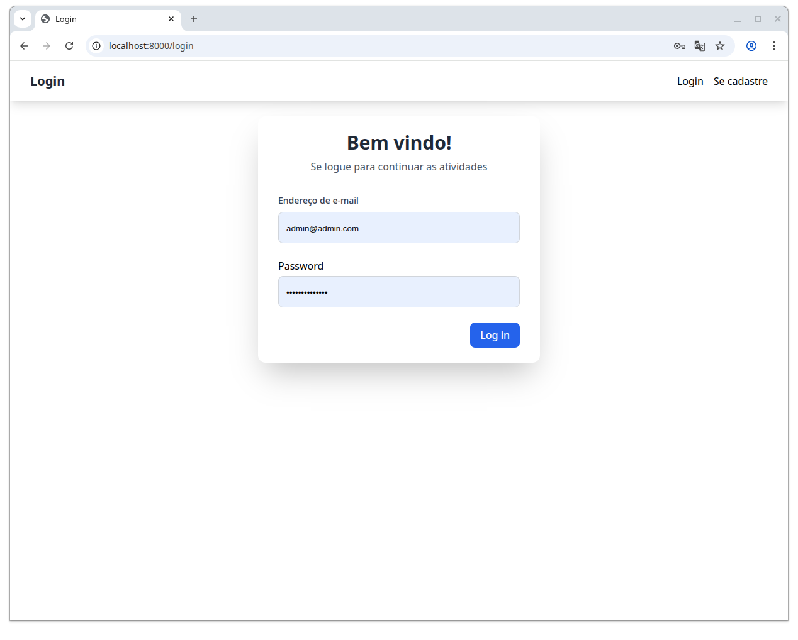

## Adicionando primeiros usuários

Depois que a aplicação é iniciada com `./start.sh`, já é possível acessar a aplicação e já possui usuário para se logar. O script de `./build` já cria o primeiro usuário para se logar:

e-mail: `admin@admin.com`
senha `strongpassword`

Ao acessar a aplicação, o usuário é direcionado para a listagem de usuários gerados automaticamente pelos seeders, ativados pelo script `build.sh`.

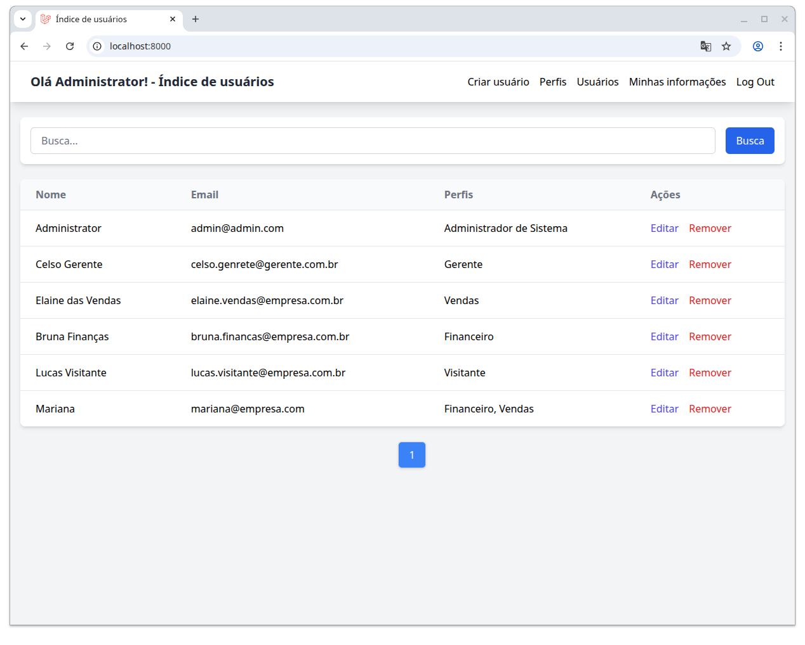

### Recursos desta tela:

* Listagem de usuários, com e-mail, perfis associados e coluna para ações de edição e remoção de usuário.
* Barra de navegação, contendo uma saudação com o nome do usuário, o nome da página e os links de navegação na parte mais à direita.
* Barra de busca, em que se coloca um termo de pesquisa e a aplicação busca tanto o termo no nome quanto no e-mail.
* Paginação, que pode ser verificada quando houverem mais de 10 usuários cadastrados (use o comando dentro do docker `php artisan app:create-testing-user --count=20`)
* Layout responsivo: todas as telas se aproveitam de estilos do Tailwind para tornar as telas mais bonitas e responsivas.

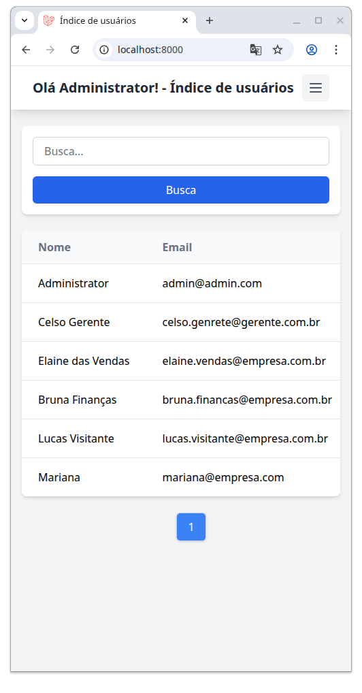

* Mensagens de seção são escritas na parte superior da aplicação nos momentos em que é preciso informar o usuário de alguma ação:

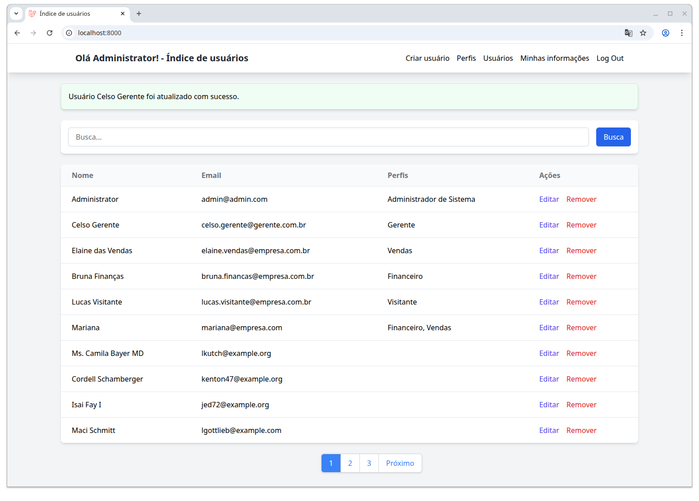

## Usuários adicionais de teste

Caso queria criar outros usuários para teste, esta aplicação possui o seguinte comando (executado dentro do container):

```
php artisan app:create-testing-user --count=20
```

ou para executar o comando fora do container:

```
docker exec -it cadastro_usuarios php artisan app:create-testing-user --count=20
```

Com isso, se consegue ver a paginação.

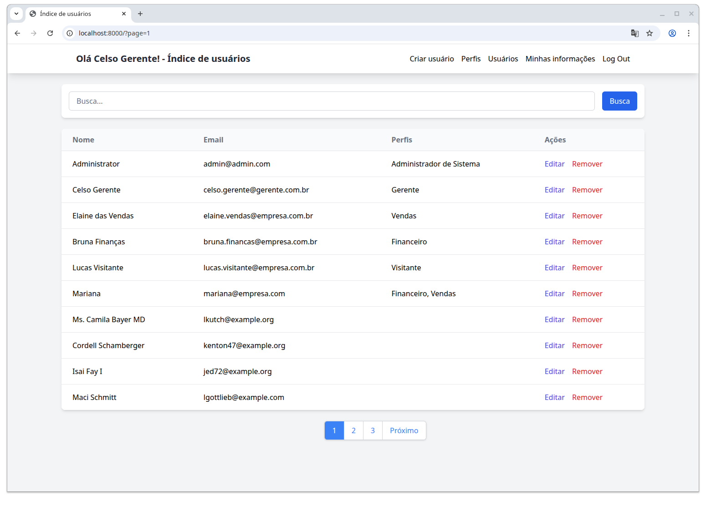

## Alteração de dados e de usuários

Apenas os usuários com o perfil "Administrador de Sistema" tem permissão de fazer alterações no sistema. Outros usuários que tentam acessar rotas de alteração de dados recebem a mensagem de falta de autorização.

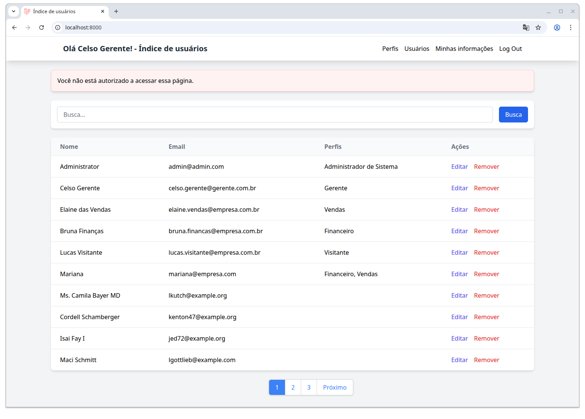

Todos usuários tem permissão apenas de alterar as suas próprias informações.

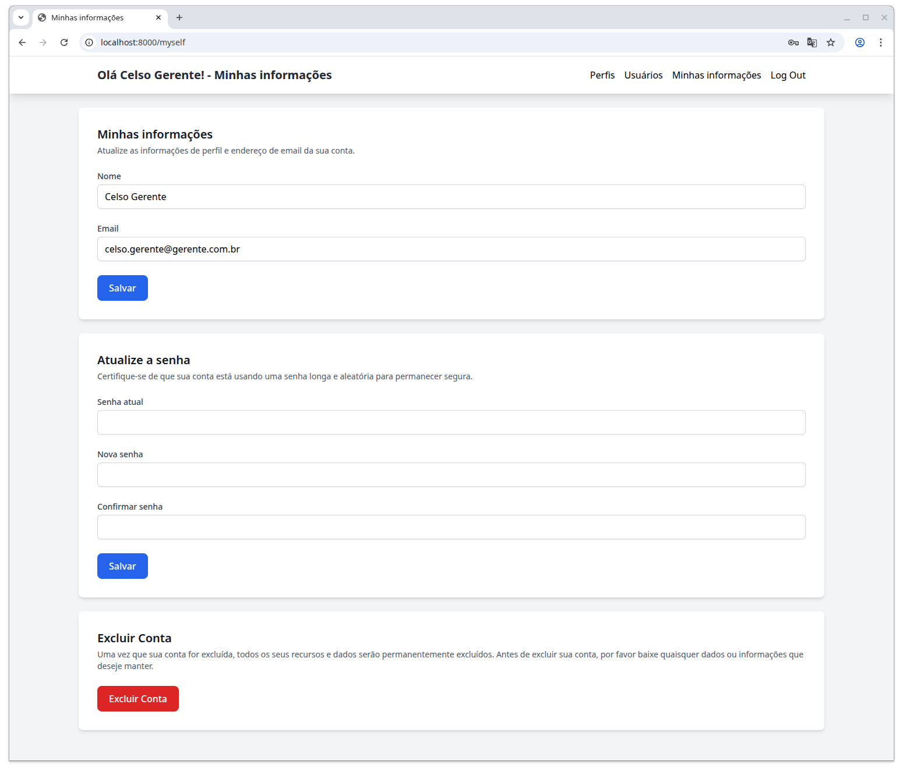

Observação: os usuários não têm permissão de alterar o seu próprio perfil. Apenas o usuário com perfil de Administrador do Sistema pode fazer isso.

## Alterando perfis

A *tela de criação* e de *tela de edição* de usuários apresentam a listagem de perfis que podem ser escolhidos por checkbox no momento da criação ou edição do usuário.

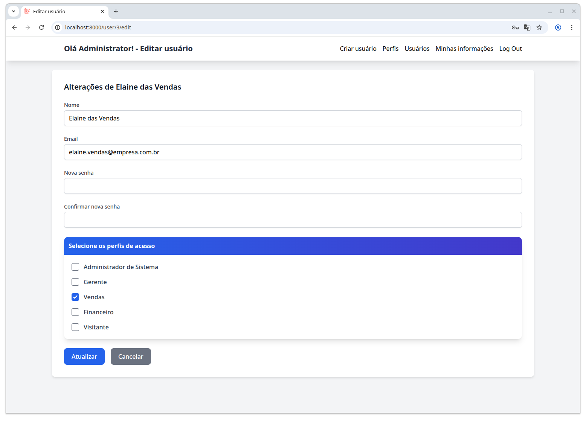

Um usuário pode receber diversos perfis ao mesmo tempo com esse recurso.

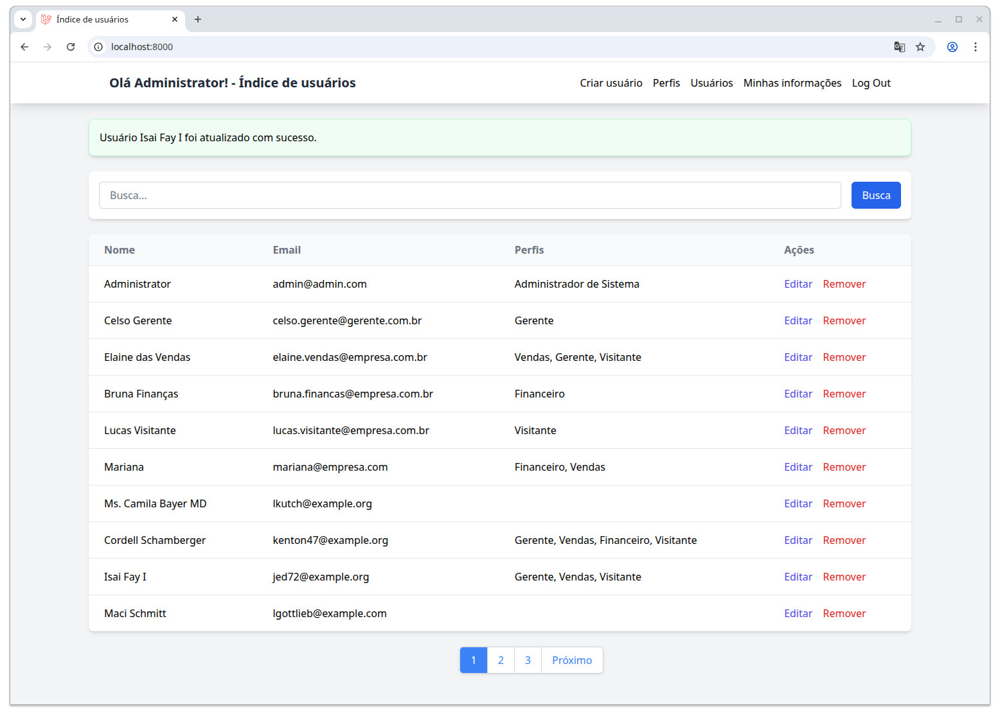

## Gerenciando perfis

No menu de navegação, se encontra um botão chamado *Perfis*. Ele é um link para a tela com a gerência de perfis, onde se é possível ver a listagem dos perfis disponíveis no sistema, criar um novo perfil, editar um perfil existente ou remover o perfil do sistema.

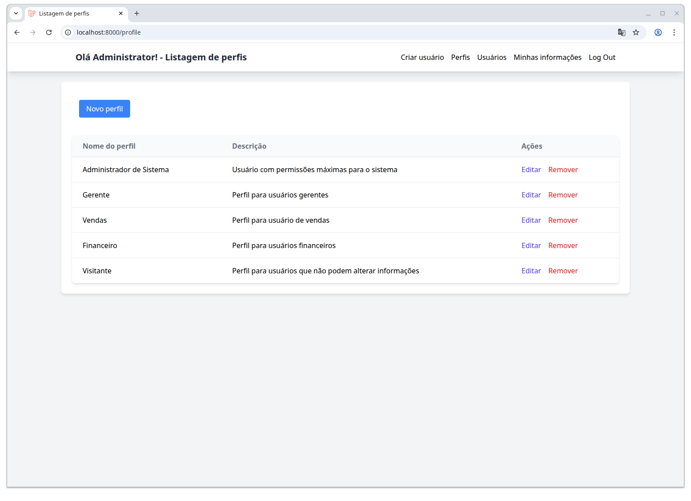

## Novos usuários

Os usuários podem entrar no sistema por três vias:

1. Tela de cadastro (disponível para usuários não cadastrados, acessável pela barra de navegação).

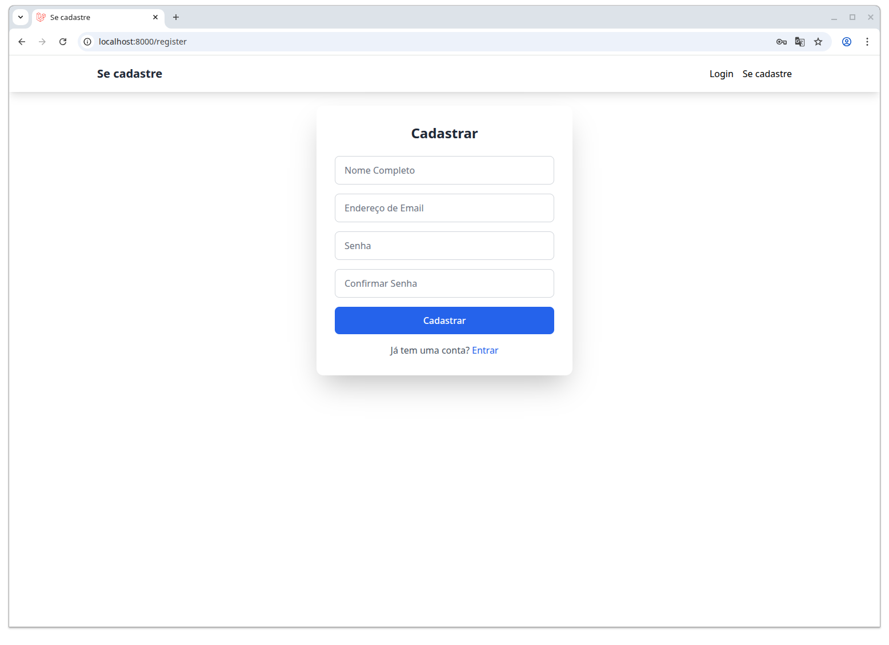

2. Pelo cadastro de usuário feito pelo usuário administrador (onde neste formulário se encontra também a listagem de perfis).

3. Pelo comando `php artisan app:create-testing-user --count=20`

## clean.sh

Limpa os arquivos criados pela compilação da aplicacão, removendo `vendor`, `node_modules`, `package-lock.json` e `composer.lock` e remove o banco de dados. Durante o desenvolvimento, isso ajuda a testar a criação do ambiente.

